> “Computer Vision algorithms enable machine to indentify and classify objects, then react accordingly. ”

# CV & Imaging

# Week 1 

Lecturer: Prof. Hamid Dehghani

F2F: 12 noon Weds， 3pm friday, 10am Mon-Zoom (Lab- section)

Matlab-Based tutorial

Robotic Vision

### Content 

[pdf]([Lecture 1.1 - Introduction.pdf](file:///C:/Users/calvchen/Downloads/Lecture 1.1 - Introduction.pdf))

Start with what we look up things: to know what is where, by looking. P15~16

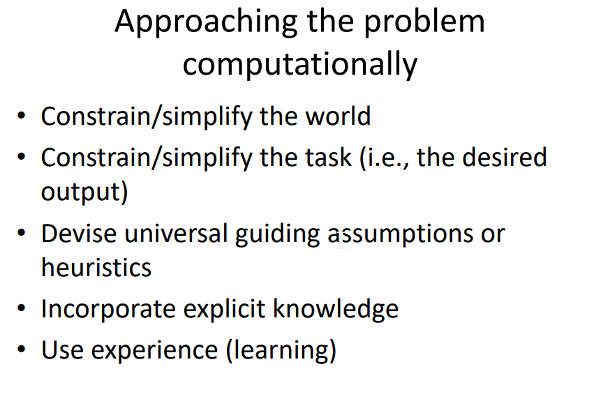

prior knowledge (physics etc.) matters

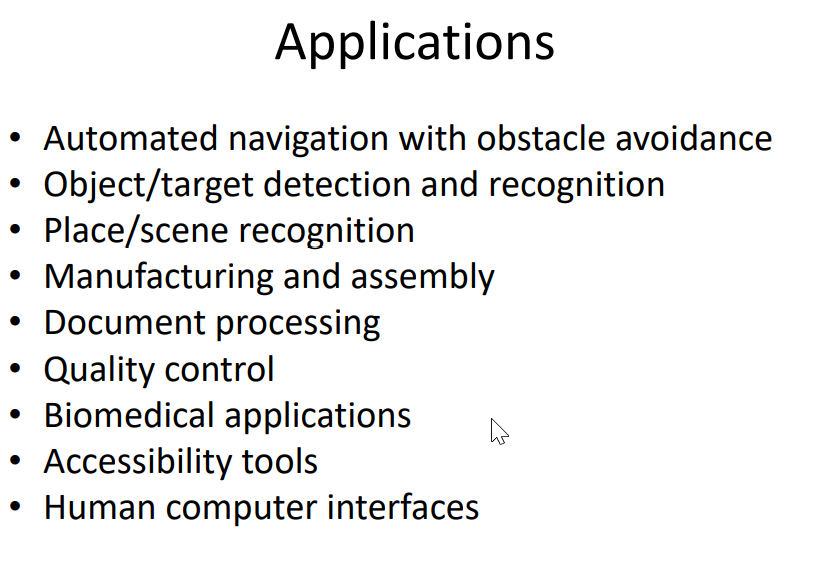

### Evolution of Eyes

We see things cuz of light reflect..

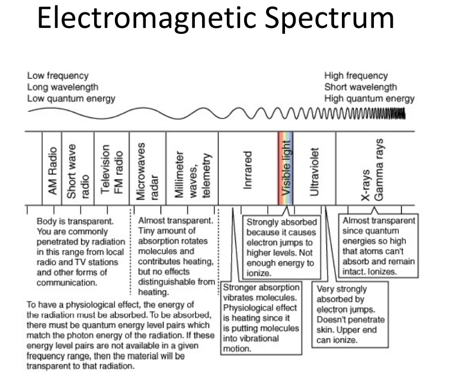

different fre light react diff with material, thus how we collect the info.

Humans perceive elevtromagnetic radiation with wavelengths 360-760nm 
$$
f=\frac{c}{\lambda}\\
E=hf
$$
E is Eberfy, c = speed of light, $\lambda$ = wavalength(m), h= Plank’s constant (6.623x$10^{32}$ Js)

- **Photocell**

Only capture light from 1-direction

- Multi cell

capture different intensity of the light with better direction resolution

**Pin Hole** for only projection

It is now a sharp image but throw away lot of info

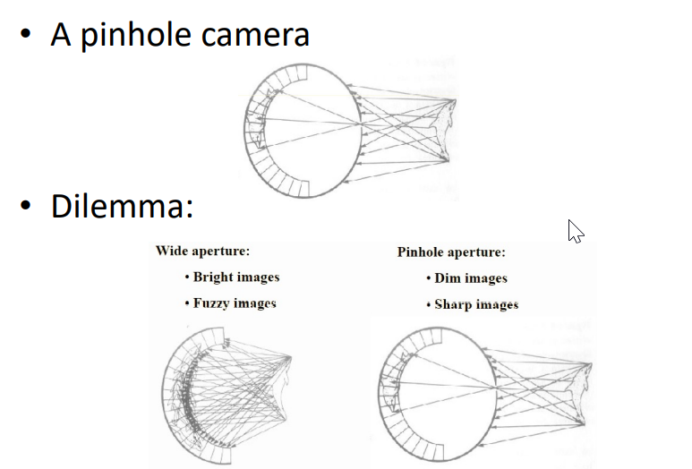

Lenses

**Snell’s Law** - looks more shallow than real

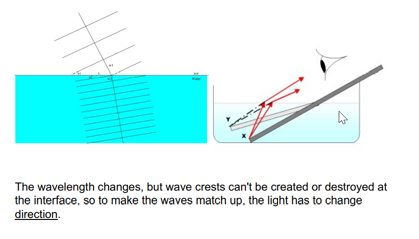

So a lens to collect and focus more info…. with the snell’s law.

pupil control the light amount

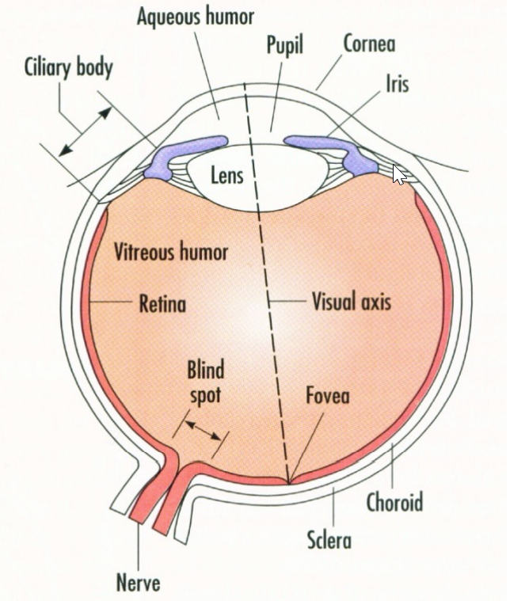

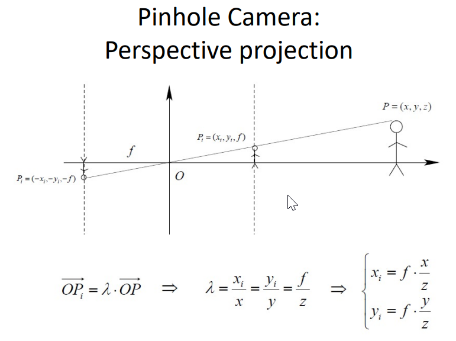

Up-side brian process the down-side vision ?????

Check it out.

What our eyes see is actually upside-down.. 

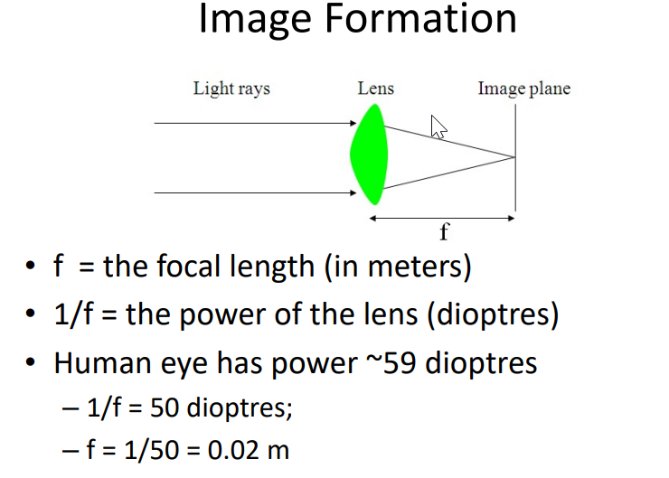

How much magnify or reduce the image.

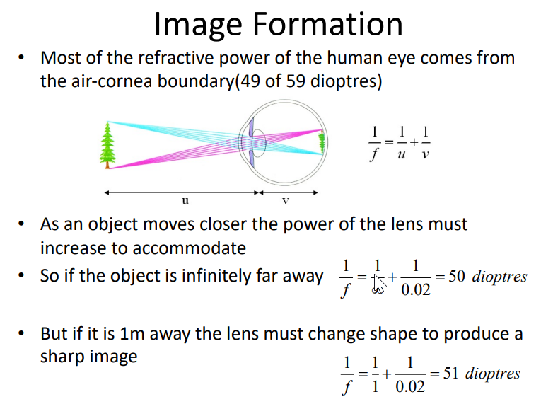

the back of the eyes is not flat..P34

### Retina 

Contains two types of Photorecepetors

- **Rods (光杆)** ~120M, sensitive but lack of spatial resolution as they converge to the same neuron within Retina. 
- **Cones (视杆)** ~6M, active at higher light levels with higher resolution as signal processed be several neurons.

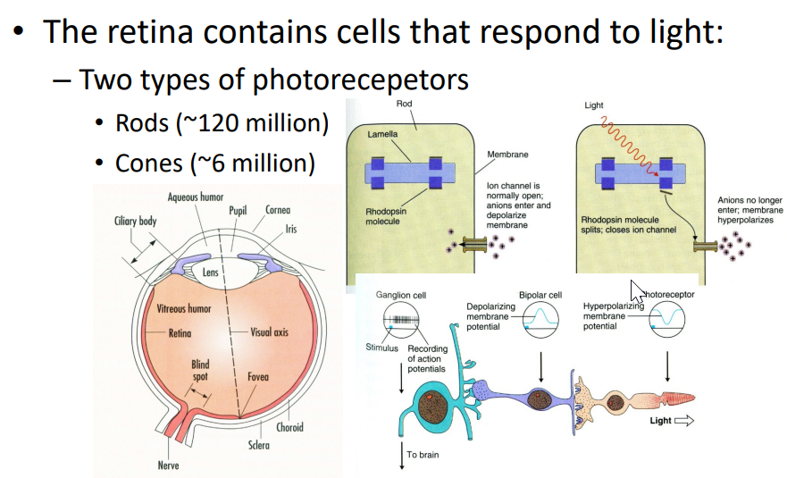

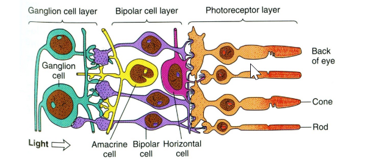

### Receptive Field

RF is the area on which light must fall for neuron to be simulated

two types of Ganglion cells: : "on-center"  and "off-center"

-  On-center: stimulated  when the center of its  receptive field is exposed  to light, and is inhibited  when the surround is  exposed to light.  
-  Off-center cells have just  the opposite reaction

[Lecture 1.2 - Human Vision (1).pdf ](file:///C:/Users/calvchen/Downloads/Lecture 1.2 - Human Vision (1).pdf) P12 ~ 13

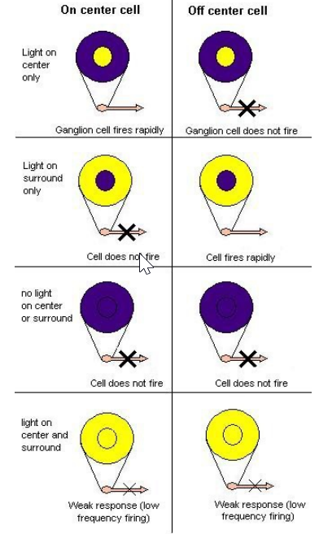

some ganglion cells are sensitive with the boundry…

Need more reading of the slides…..?

The rate of firing also tells info.

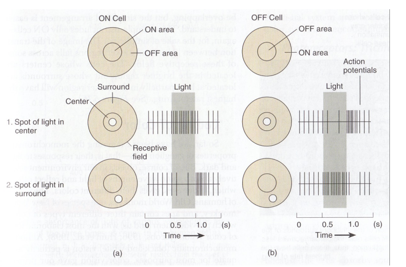

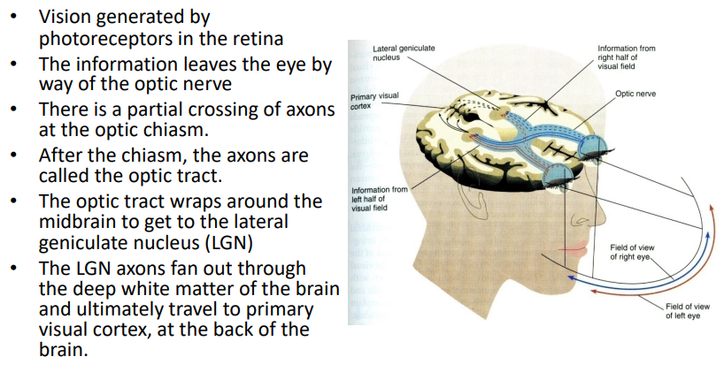

No.3 Not a total crossover? but a partial crossover. Cuz the brain needs info from both sides.

- Vision generated by  photoreceptors in the retina 
- The information leaves the eye by  way of the optic nerve 
- There is a partial crossing of axons  at the optic chiasm.  
- After the chiasm, the axons are  called the optic tract.  •
- The optic tract wraps around the  midbrain to get to the lateral  geniculate nucleus (LGN) 
- The LGN axons fan out through  the deep white matter of the brain  and ultimately travel to primary  visual cortex, at the back of the  brain.

##### Where is the Color?

Three diff types of Cones.

Thrichromatic Coding…

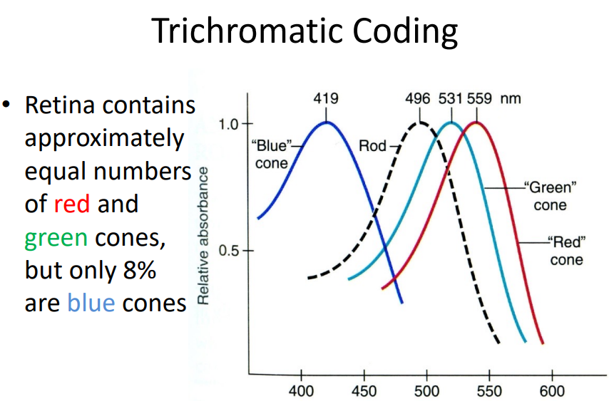

Why so less blue cones?

How to discriminate wavelengths 2nm in difference?

camera has filters allow only one type of color light to go through

### Colour Mixing

**But some colors do not exist?**

One can imaging Bluish-green or  Yellowish-green, But NOT Greenish- red or Bluish-yellow!

Many forms of colour vision proposed – Until recently some hard to disapprove • 

1930s: Hering (German Physiologist)  suggested colour may be represented in visual  system as ‘opponent colours’ 

Yellow, Blue, Red and Green – Primary colours 

- Trichromatic theory cannot explain why yellow is a  primary colour

##### Opponent Process Coding 

Bluish green, yellowish green, orange (red and yellow),  purple (red and blue) OK 

- Reddish green?? Bluish Yellow?? 
  - Opposite to each other

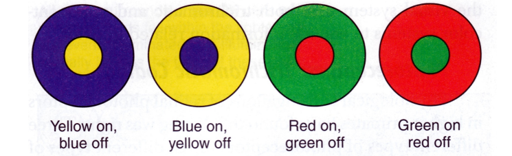

Excitation and inhibition cancel each other; no change in signal.

We have Red-green Ganglion cell and Yellow-blue ganglion cell. 

# Week 2

## Edge Detection 

image scale function in matlab

squeeze -> edge more visible

Gradient of the intensity, namely how fast the pixel changing in intensity:

$$
G_x=\frac{df}{dx},\ G_y=\frac{df}{dy},\\
M(\vec G) = \sqrt{G_x^2 + G_y^2}\\
a(x,y) = \tan^{-1}\left( \frac{G_y}{G_x}\right)
$$

$$
What\ is\ \theta=\atan2(G_x, G_y)  
$$

$M$ is for Magnitude, $a$ is for direction.

### Operators or Masks

2 by 2 matrix for the conner:
$$
G_x = \begin{bmatrix}
-1 & 1 \\
-1 & 1
\end{bmatrix},\
G_y = 
\begin{bmatrix}
1 & 1 \\
-1 & -1
\end{bmatrix}
$$

**Robert**
$$
G_x \begin{bmatrix}
1 & 0 \\
0 & -1
\end{bmatrix}\ G_y \begin{bmatrix}
0 & -1\\
1 & 0
\end{bmatrix}
$$
**Sobel**
$$
G_x \begin{bmatrix}
-1 & 0 & 1 \\
-2 & 0 & 2 \\
-1 & 0 & 1
\end{bmatrix}\ G_y \begin{bmatrix}
1 & 2 & 1 \\
0 & 0 & 0 \\
-1 & -2 & -1
\end{bmatrix}
$$
Then we can get a gradient matrix, by apply threshold we can get a binary edge image.

Edge value is actually comply **Gaussian** Ditribution, but can be quite noisy.

If we set up a threshold, we may get multi-border lines. Thus the utilization of **Canny**.

#### Gaussian (Canny) edge detection 

1. Apply [Gaussian filter](https://en.wikipedia.org/wiki/Gaussian_filter) to smooth the image in order to remove the noise
2. Find the intensity gradients of the image, using [Roberts](https://en.wikipedia.org/wiki/Roberts_Cross), [Prewitt](https://en.wikipedia.org/wiki/Prewitt_operator), or [Sobel](https://en.wikipedia.org/wiki/Sobel_operator), etc.
3. Apply gradient magnitude thresholding or lower bound cut-off suppression to get rid of spurious response to edge detection
4. Apply double threshold to determine potential edges
5. Track edge by [hysteresis](https://en.wikipedia.org/wiki/Hysteresis): Finalize the detection of edges by suppressing all the other edges that are weak and not connected to strong edges.

## Filtering

Highly Directed Work

- Second order operators 
- Thresholding

Mean filter: 

random distributed noisy (even out positive and negative noise)

Gaussian Filter:

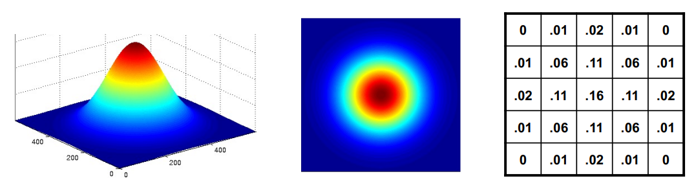
$$
G_{2D} = G_{1D}*G_{1D}^T
$$

### Laplacian Operator

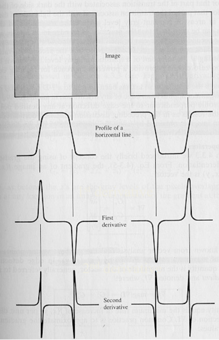

It is good to have Second Derivative, zero crossing points can be a good edge estimator, but not robust for noise.
$$
I\otimes G_{2d}\otimes\mathcal L
$$

So $ G_{2d}\otimes\mathcal L$ can be a new filter called LoG

$$
\nabla \partial
$$