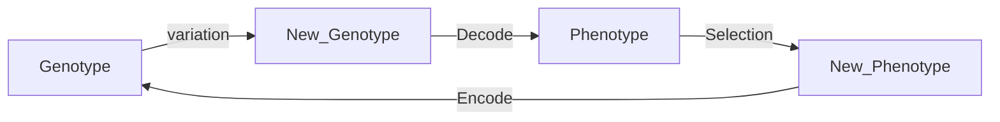

> “The study of computational systems that use ideas inspired from natural evolution, e.g., the principle of survival of the fittest.”

# Evolutionary Computation

EC provides a general method for solving ‘search for solutions’ type of problems, such as optimisation, learning, and design.

## Progress:

Week 2…


## What will be covered?

**Algorithms** 

- Randomized Search Heuristics 
- Evolutionary Algorithms: [Genetic Algorithms](#Genetic Algorithm (GA)), Genetic Programming, Evolutionary Programming, Differential Evolution and Evolution Strategies 
- Game Theory (optimisation) and Evolutionary Game Theory (dynamics) 
- Particle Swarm Optimiser & Ant Colony Optimisation 
- Artificial Immune System

**Theory** 

- Schema Theorem -
- Convergence and Convergence Rate -
- Computational Complexity -
- No Free Lunch Theorem 
- Fitness Landscape 
- Boolean Networks 
- Cellular Automata (including Game of Life)


### Categories of Algorithms by by design paradigm

- Divide and conquer algorithms, e.g., quicksort algorithm 
- Dynamic programming algorithms 
- Mathematical programming algorithms, e.g., linear programming 
- Search and enumeration algorithms 
  - Brute force (exhaustive) algorithms, enumerating all possible candidate solutions and check 
  - Improved brute force algorithms, e.g., branch and bound algorithms 
  - **Heuristic algorithms** 
    - Local search, e.g., greedy search 
    - **Randomised algorithms**, which include Evolutionary Computation, etc


### Start with Questions

**Matching one Bolt to n Distinct Sizes Nuts:**

given one bolt and a collection of n nuts of different sizes, find a nut match the bolt

The brute-force solution time complexity: O(n2)

**Answer:** For many problems, a randomised algorithm is the simplest, the fastest.


**Heuristic Algo**

CS definition of **heuristic**:  a (usually simple) algorithm that produces a good enough solution for a problem in a reasonable time frame

heuristic: find or discover non-optimal but satisfactory

Trad of optimality, completness, accuracy or precision for **speed**.

Includes determiistic (e.g. 0 or 1 results)


### Randomised Algorithm

makes random choices during execution,

output and runtime can vary even with fixed input.


Use random number to help find and improve the solutions.

##### Two representatives:

- Las Vegas Algo

  may result in infinite loop until the correct solution

  ```
  Repeat:
  	Random search 1 element out of n samples.
  	until a == x
  end
  ```

  the worst runtime complexity is unbound

- Monte Carlo Algo (蒙特卡罗)

  runs for a fixed number of steps

  ```
  i = 0
  Repeat:
  	Random search 1 element out of n samples.
  	i += 1;
  	until (a == x) || (i == k)
  end
  ```

​		O(1) is fixed


##### Randomised Quicksort Algo

avg: O(nlogn), worst: O(2nlogn)


## EA


An Evolutionary Algorithms consists of: representation: each solution is called an individual fitness (objective) function: to evaluate solutions variation operators: mutation and crossover selection and reproduction : survival of the fittest


### Genetic Algorithm (GA)

> natrual selection: survival of the fittest, 

**Observation:** Natural Evolution has evolved many complex systems (e.g., brain) and ”solved” many bioengineering problem. 

**Driving Force:** Simulate Genetic variations that enhance survival and reproduction become and remain more common in successive generations of a population (idea of Darwinian Evolution).

**Initialization**: requires many setting, including initial population, population size, selection, reproduction, mutation, and criteria for termination of algorithm.

**Genotype** (基因型): Binarye encoded solution $G\in\{0,1\}^L$ with length of $L$ assimilates Chromosomes (染色体).

**Phenotype** (表现型): Decode solution from Genotype. 



**Genetic variation Operators**: 

- **Mutations**: changes in the DNA (Deoxyribonucleic Acid) sequence.
  - Flip each bit with a probability $p_m\in[\frac{1}{L}, \frac{1}{2}]$, called mutation rate.
  - Together with selection what mutation actually does is stochastic local search: it **exploit** current good solutions by randomly **explore** near search space

- **Crossover**: reshuffling of genes through sexual reproduction and migration between populations
  - Randomly select two parents with probability $p_c\in[0,1]$.
  - K-point crossover: Select $k$ points on two strings and split strings. Alternating between the two parents and then glue parts.
  - Uniform crossover: For each $i\in \{1, \cdots, L\}$: $p=\frac{1}{2}$ copy bit $i$  from parent 1 to the offsping 1, parent 2 to the offsping 2, and vise versa. 


**Decoding Function**

- We have $n$ continous variables, how to represent them using a bit of string of length $L$.
- Divide $G$ into $n$ segments $s_i$ of equal length.
- Decode each $s_i$ into an interger $K_i$
- Apply decoding function $h(K_i)$, i.e., map the integer linearly into the interval bound $x_i\in[u_i,v_i]$

$$
h\left(K_{i}\right)=u_{i}+K_{i} \cdot \frac{v_{i}-u_{i}}{2^{\frac{L}{n}}-1}
$$


For example, assume $X = \{x_1, x_2, x_2\}$ and $X\in[-5,5]$.


