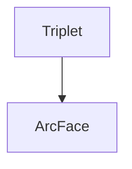

> Enlight the Darkness.

### Low-light Image Enhancement

- Retinex-Inspired Unrolling With Cooperative Prior Architecture Search for Low-Light Image Enhancement

  CVPR 2021 

  [[local](file:///C:/PaperSet/Liu_Retinex-Inspired_Unrolling_With_Cooperative_Prior_Architecture_Search_for_Low-Light_Image_CVPR_2021_paper.pdf)] [[pdf](https://openaccess.thecvf.com/content/CVPR2021/papers/Liu_Retinex-Inspired_Unrolling_With_Cooperative_Prior_Architecture_Search_for_Low-Light_Image_CVPR_2021_paper.pdf)] [[supp](https://openaccess.thecvf.com/content/CVPR2021/supplemental/Liu_Retinex-Inspired_Unrolling_With_CVPR_2021_supplemental.pdf)] [[arXiv](http://arxiv.org/abs/2012.05609)]

  

- 

- Attention Guided Low-Light Image Enhancement with a Large Scale Low-Light Simulation Dataset 

  [download](https://link.springer.com/content/pdf/10.1007/s11263-021-01466-8.pdf)

- 

- Mbllen Low-light image video Enhancement Using CNNs（BWVC18）
- Attention-guided Low-light Image Enhancement(arxiv19.8)
- Progressive Retinex: Mutually Reinforced Illumination-Noise Perception Network for Low Light Image Enhancement(ACMMM2019)
- LLNet: A deep autoencoder approach to natural low-light image enhancement

