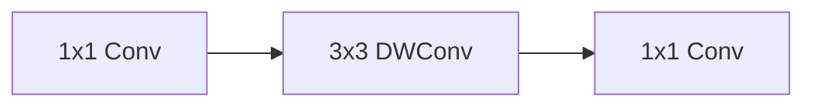
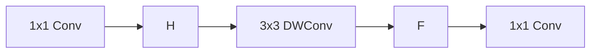

**Depthwise Conv**

1. **Split** the input and filter into channels.
2. We convolve each input with the respective filter.
3. We stack the convolved outputs together.

**Pointwise Conv**

1. use a $1\times 1$ conv, usually with more channel 

**Depthwise Separable Convolution**

paper: https://paperswithcode.com/paper/depthwise-convolution-is-all-you-need-for

N_std = 4 × 3 × 3 × 3 = 108
N_depthwise = 3 × 3 × 3 = 27 
N_pointwise = 1 × 1 × 3 × 4 = 12 
N_separable = N_depthwise + N_pointwise = 39

**Shuffle Block** V2

1. PW has much computation
2. split channel into two partitions, finally the concatted are shuffle

**c** will be fine..

**Efficient-HRNet**

1. HRNet

**GhostNet**

1x1 remains still bottle neck

1. Few small filters to generate more feature maps
2. 

**Lite-HRNet**

1. Multiple resolutions — parallel branch
2. $1\times 1$ conv too much computation, 
   - replaced with efficient conditional channel weighting unit

**Normal DWSConv**

**Ours**

$\mathcal H$ is cross-resolution weighting function. $\mathcal F$ is spatial weighting function.

**EfficientUNet++**