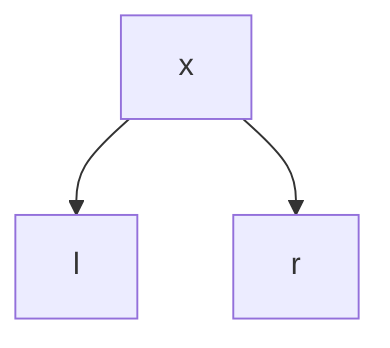
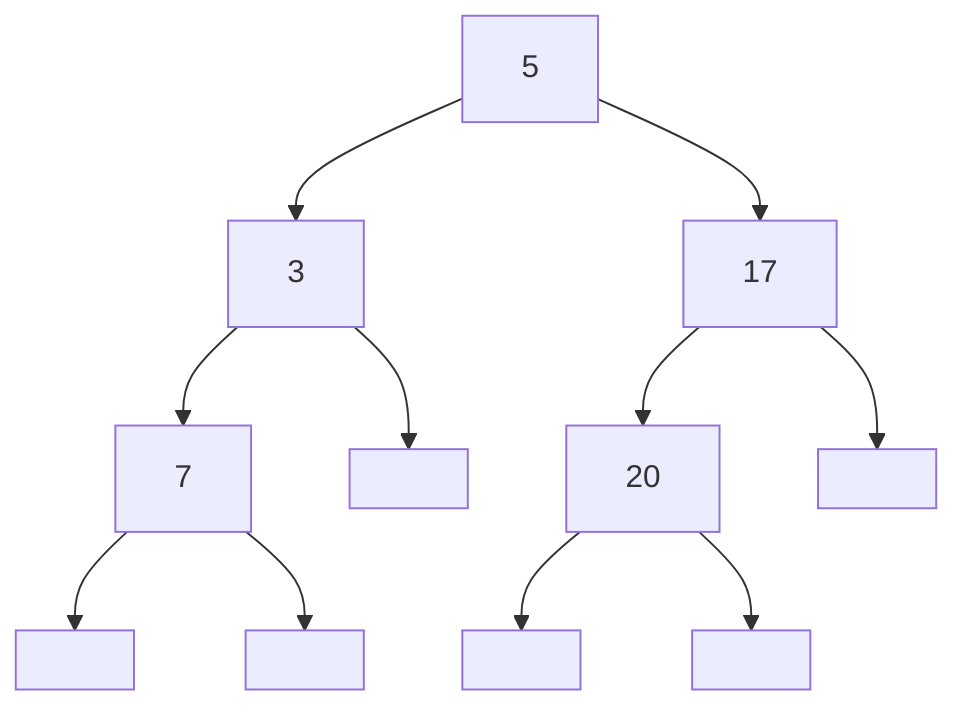
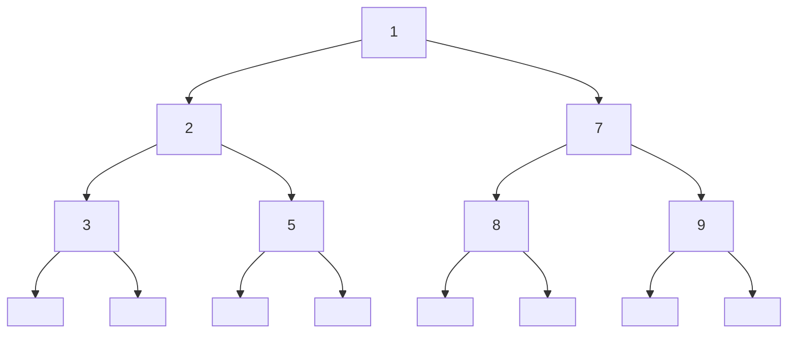
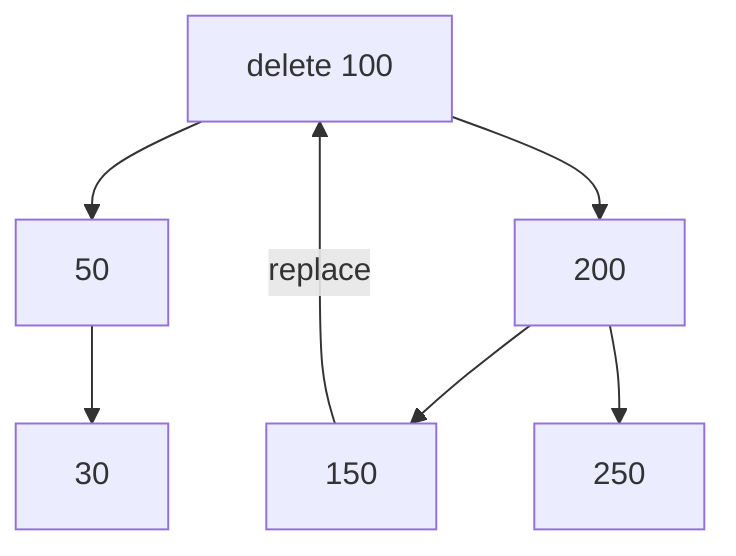

> “Basic data courses. ”

# Data Structures, Algorithms, and Databases

Recommend Books:

1. [Algorithms, 4th Edition by Robert Sedgewick and Kevin Wayne (princeton.edu)](https://algs4.cs.princeton.edu/home/)
2. [Data Structures and Algorithm Analysis (vt.edu)](https://people.cs.vt.edu/~shaffer/Book/)
3. [Book (williams.edu)](http://dept.cs.williams.edu/~bailey/JavaStructures/Book.html)

- **Kinds:** List, Trees, Tables, Graphs
- **Algorithms:** Sort, Insert, Delete, Find
- **Efficiency:** How fast? How mush memory?
- **Abstraction:** How to use? (abstract) How to implement? (concrete)
- **Specification:** What we want the algo to do?
  - Reason about its con-time complexity and space complexity

Preconditions is the condition that is **assumed to hold** at the beginning of the program.

Post-conditions is the condition that is guarenteed to hold at the end of the program.

**Invariants** is the condition that is **expected to hold** at the beginning of each **loop** iteration

Assertions is the condition that is **expected to hold** at the point where it is placed

## Search

Given an array $a$ of $n=a$ interges, then given $x$

Find an interge $y=i \text{ (for index)}$ if found, **-1** if not found.

**What if more than one found?**

- We can return the first one found.

**Linear search** on average the algo takes $\frac{n+1}{2}$ iterations, which is $O(n)$.

**Binary search** assume the $a$ is sorted (predcondition), normally is $O(log\ n)$.

- Does it really get faster? Significantly so?
  - Yes the worst case of perfect *BS* is $log_2\ n$.

Because of BS Invariant 

### Binary Search Tree (BST)

If we want to **insert** and **delete** elements efficiently, it will require using BST.

**Delete and insert from sorted array**

- Find the element takes $O(log\ n)$
- Shift left $z$ portion of the array takes $O(n)$, we don’t want this happened.
  - Delete require the left $z$ portion of the array to shift
  - Insert require the array to right $x$ portion to shift right

The solution will be: ***Sorted Tree***.

How to build it?

- Step 1: Have the empty tree, writen as *Empty* or $\Box$, represent by \*. 
- Step 2: Given label $x$, $l$ and $r$, represents root, left and right subtrees. we can build a new tree $\text {Fork}(x,l,r)$, 

Nodes is the number of roots, dispite the end subtrees.

Height is the max depth of the Nodes.

Which Nodes = 5, Height = 3. The height grows logrithmically.

Leaf is the node with two empty tree. 

**Formulas to calculate:**

For convenience, we use abbreviation for short:
$$
\text{Use }n(\cdot)\ \&\ h(\cdot)\text{ for \#nodes}(\cdot)  \ \&\ \text{height}(\cdot) \\
\text{Use F for Fork}(x,l,r) \\
$$
So we have
$$
n(\Box) = 0,\ h(\Box) = 0\\
n(\text F) = 1 + n(l)+n(r)\\
h(\text F) = 1 + \max(\ h(l),h(r)\ )
$$
**Perfectly balanced tree** **(PBT)**

The right the left tree of any node have the same height

**Formulas**
$$
\text{isPB}(\Box) = \text{true}\\
\text{isPB}(\text F) = (\ \text h(l)==\text h(r)\ )
$$
The number of nodes of whole PBT is $2^{\text(height)}-1$, of each layer is $2^{\text(height-1)}$.

If the tree is nearly balanced, the worst case of searching is $O(log\ n)$.

### Insert in BST

- If already exist, we can either report an error or leave it unchanged 

Define
$$
\text{isIn}(x,t) =
\left\{\begin{array}{ll}
\text {true,} & \text { if } x \text { occurs in }t\\
\text {false,} & \text{otherwise}
\end{array}\right.
$$

$$
\text{isIn}(x, \Box) = \text{false}\\
\text{isIn}(x, \text F(y,l,r)) = (\ x==y\ ) || \text{(find subtrees)}\\
\text{find subtrees} = (x<y)\ \&\&\ \text{isIn}(x, l) ||(x>y)\ \&\&\ \text{isIn}(x, r)
$$

### Deletion

- Case 1: Delete a leaf.
- Case 2: Delete a node with only one side.
  - We move up the other subtree
- Case 3: Delete a node with both sides.
  - We replace the vacant node by the *left-most* node or *smallest* node of the right subtree.

> All cases take $O(log\ n)$ steps assuming the tree is balanced.

## AVL Trees

Adelson-Velski and Lzudis Trees or called **self-balancing Binary Search Tree**

BST tend to grow unbalanced, we then lose the $O(log\ n)$ good time behavior. Can we assume extra conditions to make sure that the height of the tree is under control?

**Why we will lose it?**

The extreme case that all the nodes come in one line will perform like linear search.

Assuming space is $O(n)$ for both. 

The worst case of BST is $O(n)$, but AVL remain still $O(log\ n)$.

**How to do it?**

- Assume additional conditions to keep the trees balanced.
- Define some concepts before we can state these conditions.

**Concept #1** Height of the node 

Length of the *longest* path from that node to the leaf node

Equal to the height of the subtree at that node.

**Concept #2** **Balance at the node**

(Height of left subtree) - (Height of right subtree) 

perfectly balanced, that is, the balance of each node is 0.

height of empty tree is -1, 

Then height of subtree at that node will be height of left subtree + 1 (for the node itself). Same is true if node has only right subtree.

**Concept #3** AVL tree

the balance at every node is $-1, 0 \text{ or } 1$.

Why consider this concept?

- Difficult to get perfectly balanced trees.
- Easier to keep trees AVL balanced.
- AVL balance is good enough to get fast algo.

**Concept #4** Perfectly Balanced Tree

The balance of every node is **0**.

General, we have: 
$$
n=2^h-1
$$
It is the best case of AVL Tree.

What is the **worst case**: 

>  We now use Fibonacci numbers.

Here, $F(\cdot)$ for Fibonacci function (start from 0 and 1).
$$
F(k) = \frac{\left(\frac{\sqrt(5)+1}{2}\right)^k - \left(\frac{\sqrt(5)-1}{2}\right)^k}{\sqrt 5}=O(1.61^k)
$$
And we have
$$
F(h+2)-1 = n
$$
Always, we have lower and upper bound of number of nodes:
$$
F(h+2)-1 \leq n \leq 2^h-1 \\
O(1.61^k) < n < 2^h
$$
Why we don’t specify the base of $O(log\ n)$?
$$
log_{10}(n) = O(log_2(n)) \\ 
log_{2}(n) = O(log_10(n))
$$
Only different with a constant factor, so it doesn’t work for O notation.

**Back to AVL Tree**

From the lower and upper bound, it implies $h = O(log\ n)$, which is something we didn’t have for BS trees.

- Invariant:
  - The balance of every node is -1, 0 or 1.

**Algo for AVL trees**

- Search: Now it really is $O(log\ n)$.
- Insert & Deletion: As before, but additionally no necessarily rebalacing. 
  - Fisrt BST method
  - Check AVL balance and fix it if necessary.
  - Can be done in total time $O(log\ n)$.

AVL Insertion Example

Need to fix the resulting tree…

Four Result Cases:

AVL insert Case LL:

AVL insert Case RR:

AVL insert Case LR:

AVL insert Case RL:

**AVL Tree Deletion**

- Delete using the BST algo
- Rebalance as necessary as before.

### Fibonacci Trees

$$
T_{-1},T_0, T_1,\dots
$$

T−1 is the empty tree • 

T0 is the one element tree • 

Th+2 is obtained by making Th and Th+1 children of the root node (as shown in the picture on the previous slide)

